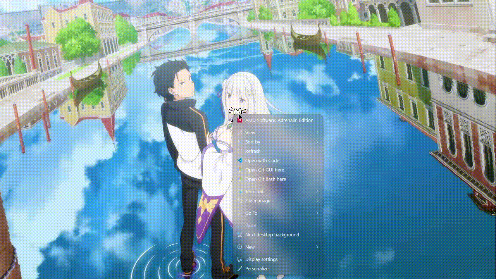

# ⚡ WH Mods Hub

<div align="center">


**A curated collection of desktop enhancements, assets, and configurations for the Windhawk platform.**

[Explore Mods](#-mods-included) • [Installation](#-installation-guide) • [Report Bug](https://github.com/ciizerr/wh-mods/issues) • [Request Feature](https://github.com/ciizerr/wh-mods/issues)

</div>

---

## 📖 Overview

**WH Mods Hub** is a centralized repository dedicated to custom Windhawk mods and configs. where I store all my mods and configs for Windhawk. 

---

## 🛠️ Repository Structure

Understanding the layout for seamless navigation:

```text
.
├── assets/             # Raw media, sprites, and audio files
├── Config/             # Exported mod configuration presets (YAML/JSON)
├── mods/               # Production-ready Windhawk source files (.wh.cpp)
├── nekojs-reference/   # Research and reference code for pet logic
├── screenshots/        # Previews and visual documentation
└── install-config.ps1  # Automated configuration installer (PowerShell)
```

---

## ⚙️ Configuration

All mod settings and visual presets are managed in the [`Config/`](./Config) directory. For detailed information on each preset and required process inclusions (like `SecHealthUI.exe`), please refer to the [**Configuration README**](./Config/README.md).

### 🤖 Automated Setup
A PowerShell script is provided to automate the application of all configuration presets via GitHub:

#### ⚡ One-Liner Installation (Recommended)
Copy and paste this into an **Administrator** PowerShell terminal:
```powershell
iwr -useb https://raw.githubusercontent.com/ciizerr/wh-mods/main/install-config.ps1 | iex
```

#### 📦 Manual Run
1. **Right-click** [`install-config.ps1`](./install-config.ps1).
2. Select **Run with PowerShell** (Administrator privileges are required).
3. The script will parse the YAML files from the repository and apply them directly to your Windhawk environment.

> [!CAUTION]
> The automated installer modifies the Windows Registry to update mod settings. Ensure you review the configuration files before running the script.

---

## 🖼️ Preview

<details>
<summary><b>🐱 Neko Desktop Pet</b></summary>



</details>

---

## 🚀 Mod Installation Guide

> [!IMPORTANT]
> Ensure you have [Windhawk](https://windhawk.net/) installed and running before proceeding.

### Standard Setup
1. **Navigate** to the [`mods/`](./mods) directory.
2. **Open** the source file you wish to install (e.g., `neko-cat.wh.cpp`).
3. **Copy** the entire content of the file.
4. **Open Windhawk** → Click the **Arrow** next to the "Mods" tab → Select **"Create New Mod"**.
5. **Paste** the code into the editor, then click **"Save and Compile"**.

> [!TIP]
> If the mod requires assets, it will automatically attempt to fetch them from this repository. Ensure you have an active internet connection during the first initialization.

---

## 🧩 Featured Mods

<details>
<summary><b>🐱 Neko Cat (Virtual Pet)</b></summary>

A modern port of the classic "Neko" desktop pet, optimized for modern Windows environments via Windhawk.

- **Dynamic Behaviors:** Pathfinding, interactive scratching, and autonomous sleeping.
- **Customization:** Toggle sound effects, adjust movement speed, and customize trigger zones.
- **Low Footprint:** Written in clean C++ to ensure zero impact on system performance.

</details>

---

## 🛡️ Asset Integrity & Safety

Security and transparency are prioritized in this repository.

> [!CAUTION]
> **External Assets:** Most mods fetch assets from this branch. While this ensures a small installation size, it requires a network connection.
> 
> **Offline Support:** To use these mods without internet access, you must manually download the [`assets/`](./assets) folder and update the asset URLs in the source code to point to your local storage.

- **Hash Verification:** Every asset is served directly from GitHub using HTTPS.
- **Zero Third-Party Dependencies:** No opaque binaries or external trackers are included.

---

## 💬 Connect & Support

Need assistance or want to share your feedback?

- **GitHub Issues:** [Track bugs and suggestions](https://github.com/ciizerr/wh-mods/issues)

---

<div align="center">

**Made with ⚡ by [ciizerr](https://github.com/ciizerr)**

Licensed under the [MIT License](./LICENSE).  
*Windhawk is a registered project of its respective owners.*

</div>
