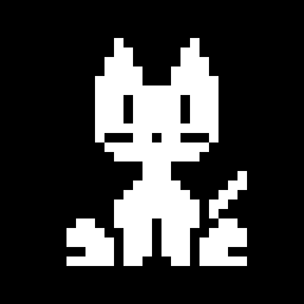

# WH Mods Hub

<div align="center">


**A collection of custom mods and configurations for Windhawk.**

[Mods](#featured-mods) • [Installation](#installation) • [Report Issue](https://github.com/ciizerr/wh-mods/issues)

</div>

---

## Overview

WH Mods Hub is a personal repository where I store my custom mods, configurations, and assets for the Windhawk platform.

## Repository Structure

```text
.
├── assets/             # Media and audio files
├── Config/             # Exported configuration presets
├── mods/               # Windhawk source files (.wh.cpp)
├── previews/           # Visual documentation
└── install-config.ps1  # Automated configuration installer
```

## Configuration

Mod settings and presets are managed in the [`Config/`](./Config) directory. For details on each preset and required process inclusions, see the [Configuration README](./Config/README.md).

### Automated Setup

A PowerShell script is provided to apply configuration presets automatically.

**One-Line Installation**  
Run the following in an Administrator PowerShell terminal:
```powershell
iwr -useb https://raw.githubusercontent.com/ciizerr/wh-mods/main/install-config.ps1 | iex
```

**Manual Run**
1. Right-click [`install-config.ps1`](./install-config.ps1).
2. Select **Run with PowerShell** (Administrator required).

> [!WARNING]
> The automated installer modifies the Windows Registry. Please review the configuration files before running the script.

## Previews

<details>
<summary><b>Desktop Pets Previews</b></summary>

### 🏃 Character Options
| Neko Cat | Sakura | Tomoyo |
| :---: | :---: | :---: |
|  |  |  |

### 🎮 Mod Interaction Preview


</details>

## Installation

> [!NOTE]
> [Windhawk](https://windhawk.net/) must be installed and running.

1. Go to the [`mods/`](./mods) directory.
2. Open the source file you want to install (e.g., `neko-cat.wh.cpp`).
3. Copy the file contents.
4. In Windhawk, click the arrow next to the "Mods" tab and select **Create New Mod**.
5. Paste the code into the editor and click **Save and Compile**.

> [!NOTE]
> If a mod requires assets, it will download them from this repository automatically. An active internet connection is required during the first initialization.

## Featured Mods

<details>
<summary><b>Neko Cat (Virtual Pet)</b></summary>

A port of the classic "Neko" desktop pet, optimized for modern Windows environments via Windhawk.

- **Behaviors:** Pathfinding, scratching, and sleeping.
- **Customization:** Toggle sound, adjust speed, and customize trigger zones.
- **Performance:** Written in C++ for minimal system impact.

</details>

## Assets and Safety

- **External Assets:** Most mods fetch assets from this repository to keep the installation size small. This requires a network connection.
- **Offline Support:** To use mods offline, download the [`assets/`](./assets) folder and update the asset URLs in the source code to point to your local paths.
- **Integrity:** Assets are served directly from GitHub using HTTPS. No third-party binaries or trackers are included.

## Contact

- **Issues and Suggestions:** [GitHub Issues](https://github.com/ciizerr/wh-mods/issues)

---

<div align="center">

By [ciizerr](https://github.com/ciizerr)  
Licensed under the [MIT License](./LICENSE).

</div>
